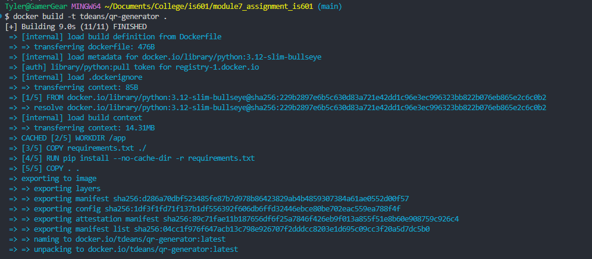
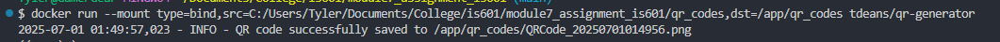

## QR Code Generator

This project is a QR code generator that allows users to create QR codes with customizable colors and background.

Docker Hub Repository
[QR Code Generator](https://hub.docker.com/repository/docker/tdeans/qr-generator/general)

Docker Build

Docker Logs

GitHub Action

